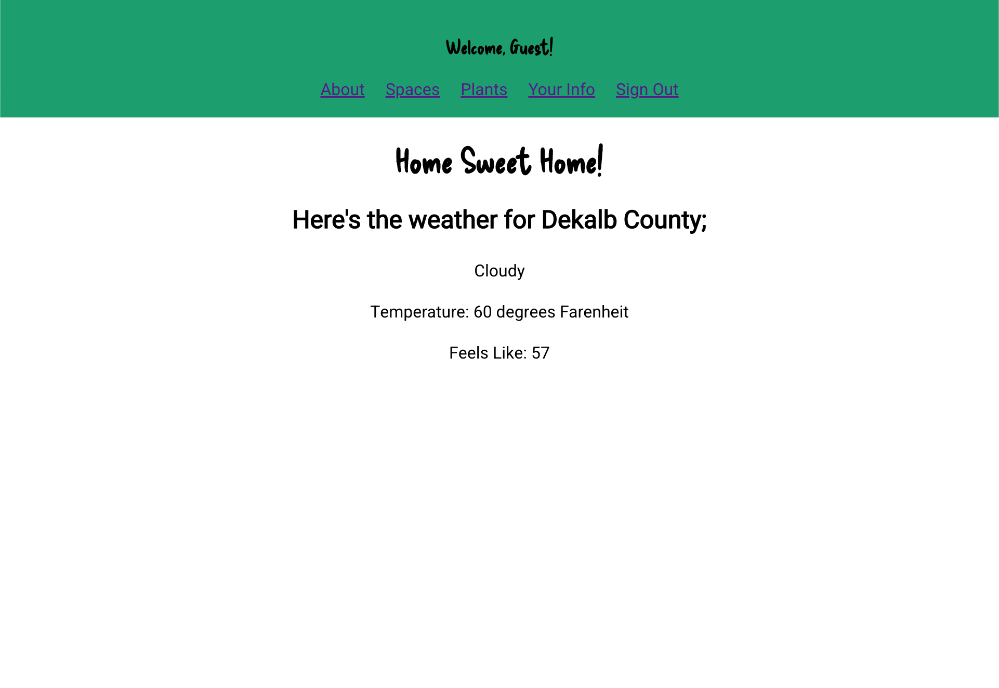
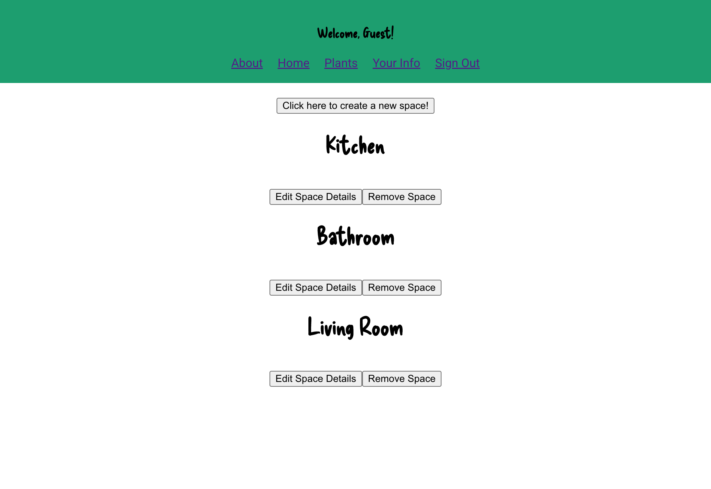
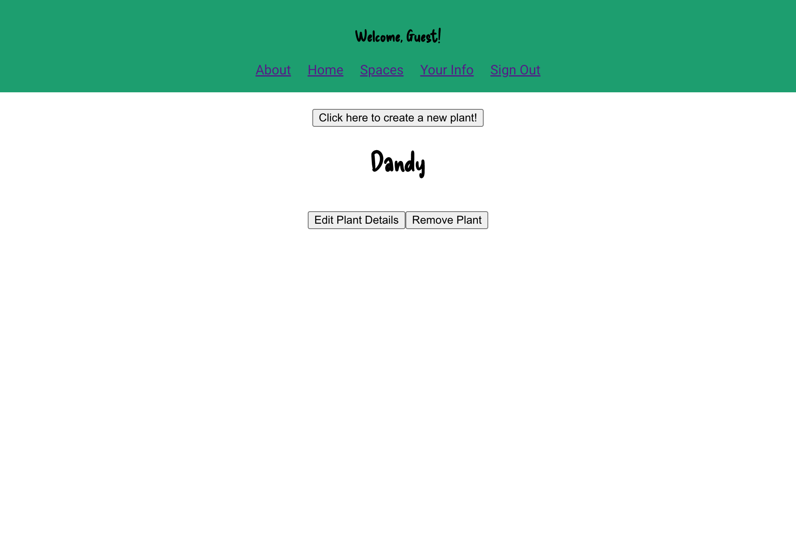

# Plantiful

### Care for your indoor and outdoor plants with this easy-to-use app!

Plantiful aims to be a place where you can assess your plants health in real time, get tips on plant care, and keep a schedule to stay on track.

Technologies uses in this app:
HTML / CSS / Javascript / React.js

Future Features:

- Deployment
- Ability to read moisture and uv levels for each plant
- Ability to

Updates:
The basic website is built!

Links:
[Trello](https://trello.com/b/z8PmHZiu/plantiful)
